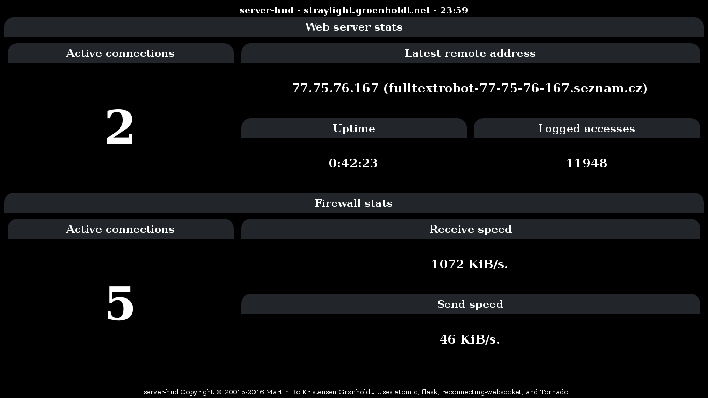

# Server HUD

Status display running on an old LG netbook. Shows the status of the firewall
and the web server.

The WebSocket daemon depends on the `tornado`and `watchdog` python packages.

## Security
**server-hud communicates in clear text over WebSocket connections. There is no
inherit security at all.**

## Files and folders

 * `dist`: Python packages.
 * `docs`: Documentation.
 * `roles`: Ansible roles to install server hud.
 * `scripts`: Entry points for the client and server.
 * `serverhud`: The Server HUD python source.
 * `systemd`: Systemd service files.
 * `tests`: Tests
 * `build_pip.sh`: Build Server HUD into a Python Package.
 * `Makefile`: Actually updates the Python package when sources have changed.
 * `MANIFEST.in`: Non Python files to include in the package.
 * `README.rst`: Python package description.
 * `setup.py`: Packaging information
 * `version`: Package version
